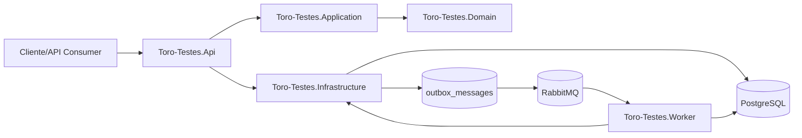
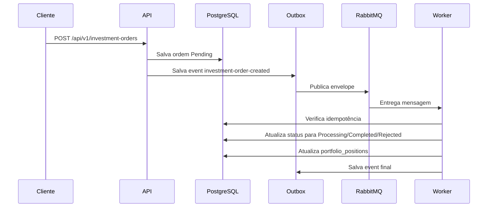

# Toro-Testes

Backend em .NET 8 inspirado em uma corretora de investimentos focada em produtos de renda fixa. A solução demonstra arquitetura enterprise com separação em projetos, CQRS com MediatR, RabbitMQ para processamento assíncrono, PostgreSQL com EF Core, autenticação JWT, políticas de autorização, observabilidade, testes unitários e testes integrados com Testcontainers.

## Visão geral

O fluxo principal implementado cobre:

- login local com JWT
- consulta de produtos de renda fixa
- envio de ordem de compra
- persistência da ordem no PostgreSQL
- gravação do evento em outbox
- publicação assíncrona no RabbitMQ
- consumo por Worker com idempotência
- atualização de status da ordem
- atualização da carteira consolidada
- consulta posterior de ordens e portfólio

Credenciais locais de seed:

- `admin@torotestes.com` / `Toro@123`
- `investor@torotestes.com` / `Toro@123`

## Contexto do negócio

O sistema representa um backend de investimentos com foco inicial em produtos de renda fixa:

- CDB
- Tesouro
- LCI
- LCA

Regras implementadas:

- produto precisa existir e estar ativo
- valor da ordem precisa respeitar o mínimo do produto
- ordens nascem com `Pending`
- LCI e LCA exigem carência
- produtos possuem vencimento
- o Worker não processa a mesma mensagem duas vezes
- ordens podem ser rejeitadas por regra simplificada de risco
- a carteira reflete ordens concluídas com sucesso

## Arquitetura



### Estrutura da solução

```text
Toro-Testes.sln

src/
  Toro-Testes.BuildingBlocks/
  Toro-Testes.Contracts/
  Toro-Testes.Domain/
  Toro-Testes.Application/
  Toro-Testes.Infrastructure/
  Toro-Testes.Api/
  Toro-Testes.Worker/

tests/
  Toro-Testes.UnitTests/
  Toro-Testes.IntegrationTests/
```

### Responsabilidade dos projetos

- `Toro-Testes.BuildingBlocks`: result pattern, abstrações compartilhadas, constantes, exceptions e correlation id.
- `Toro-Testes.Contracts`: envelopes e eventos de integração publicados via RabbitMQ.
- `Toro-Testes.Domain`: entidades, enums, value objects e regras centrais.
- `Toro-Testes.Application`: commands, queries, handlers, validators, DTOs Request/Response, DTOExtension e behaviors.
- `Toro-Testes.Infrastructure`: EF Core, repositórios, JWT, RabbitMQ, outbox, health checks e observabilidade.
- `Toro-Testes.Api`: controllers HTTP, versionamento, Swagger, middleware global, auth, policies e rate limit.
- `Toro-Testes.Worker`: consumo de fila, idempotência, retry simples, DLQ simplificada e processamento assíncrono.
- `Toro-Testes.UnitTests`: testes de validators, handler, regra de domínio e mapeamento.
- `Toro-Testes.IntegrationTests`: fluxo ponta a ponta com PostgreSQL e RabbitMQ reais via Testcontainers.

## Fluxo assíncrono



## Stack utilizada

- .NET 8
- ASP.NET Core Web API
- Worker Service
- Entity Framework Core
- PostgreSQL
- RabbitMQ
- MediatR
- FluentValidation
- JWT Bearer Authentication
- Authorization Policies
- Serilog
- OpenTelemetry
- Health Checks
- xUnit
- FluentAssertions
- Testcontainers
- Docker / Docker Compose

## Endpoints principais

- `POST /api/v1/auth/login`
- `GET /api/v1/investment-products`
- `GET /api/v1/investment-products/{id}`
- `POST /api/v1/investment-products`
- `POST /api/v1/investment-orders`
- `GET /api/v1/investment-orders/{id}`
- `GET /api/v1/investment-orders/customer/{customerId}`
- `GET /api/v1/portfolio/{customerId}`
- `GET /api/v1/portfolio/{customerId}/positions`
- `GET /health`
- `GET /health/live`
- `GET /health/ready`

## Como rodar localmente

1. Suba PostgreSQL e RabbitMQ:

```bash
docker compose up postgres rabbitmq -d
```

2. Restaure os pacotes:

```bash
dotnet restore Toro-Testes.sln
```

3. Aplique as migrations:

```bash
dotnet ef database update --project src/Toro-Testes.Infrastructure --startup-project src/Toro-Testes.Api
```

4. Inicie a API:

```bash
dotnet run --project src/Toro-Testes.Api
```

5. Inicie o Worker:

```bash
dotnet run --project src/Toro-Testes.Worker
```

## Docker Compose completo

```bash
docker compose up --build
```

Serviços expostos:

- API: `http://localhost:8080`
- Swagger: `http://localhost:8080/swagger`
- RabbitMQ Management: `http://localhost:15672`

## Testes

Unitários:

```bash
dotnet test tests/Toro-Testes.UnitTests
```

Integrados:

```bash
dotnet test tests/Toro-Testes.IntegrationTests
```

## Decisões técnicas

- `DTOs/Requests`, `DTOs/Responses` e `DTOs/Extensions` foram separados explicitamente para manter o contrato de entrada e saída limpo.
- O endpoint de criação de ordem retorna `202 Accepted` porque o processamento de negócio ocorre de forma assíncrona.
- Outbox foi implementado para desacoplar persistência da ordem e publicação no RabbitMQ.
- Idempotência no Worker usa `processed_messages`.
- A autenticação é local/mockada por seed para simplificar o foco no backend arquitetural.

## Trade-offs

- O processamento de risco é simplificado para manter foco na arquitetura.
- A estratégia de retry e dead-letter é básica, mas deixa o caminho preparado para robustez maior.
- O projeto usa seed local em vez de um fluxo completo de cadastro/identidade.

## Próximos passos

- adicionar outbox polling com lock otimista para múltiplas instâncias
- enriquecer tracing de mensageria com spans customizados
- incluir Prometheus, Grafana e Jaeger/Tempo no `docker-compose`
- adicionar cancelamento de ordem e conciliação financeira
- ampliar cenários de teste de falha e reentrega
